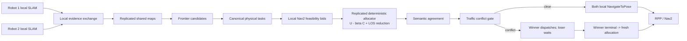

# Professor demo cheatsheet

## What the robots exchange

Each robot extracts local frontier candidates from its evolving occupancy map. A bounded snapshot contains physical signature, centroid/bounds, approach pose, frontier samples, visible-cell samples when available, and local feasibility metadata. The peers exchange snapshots, local Nav2 bids, pair decisions, status, and failure evidence. The two replicas use session IDs, epochs, round IDs, union hashes, TTLs, bid fingerprints, and decision hashes.

## Allocation

Canonicalization merges two detections of the same physical frontier before bidding. For each eligible canonical task, `U_t=1`. Each robot computes only its own Nav2 `ComputePathToPose` polyline. Its length is `L_i,t` metres and the project cost is `C_i,t=clamp(L_i,t/18,0,1)`. The selected pair maximizes:

```text
S(i,t) = U_t - beta*C_i,t       beta = 1.0
```

After a selection, every remaining task within the configured lidar range receives `U_t' = U_t - (1-d/R)` when the shared-map ray is clear. An occupied cell above threshold 50 or a map-boundary exit blocks the reduction; unknown cells alone do not. A single canonical task therefore gives one robot the task and leaves the other IDLE.

This is a project adaptation of Burgard et al.: canonical tasks and Nav2 path lengths replace individual frontier cells and value-iteration costs. The old visible-frontier gain was a boundary-length quantity in metres; it is retained only in compatibility/diagnostic fields, not the production ranking.

## Navigation failures

A path failure, planner/controller failure, timeout, cancellation, or TF/lifecycle problem is classified from terminal evidence. Only the existing hard/unreachable suppression path excludes a task; records are scoped to task/region and expire under the existing retry semantics. This avoids a permanent magic `-5` penalty while allowing an evolving map to make a region eligible again.

## Traffic

Frontier utility answers *where to explore*. Traffic answers whether the two selected new routes can be dispatched together. Continuous path-segment geometry compares the planned centerlines against the configured safety separation: `0.08+0.08=0.16 m`, where 0.08 m is the frozen Collision Monitor stop-circle radius. Priority is an already-active robot, then lower ETA to the first conflict (`distance/0.13 m/s`), then lower robot ID only for an exact ETA tie. The loser enters `WAITING_FOR_TRAFFIC`; its NavigateToPose action is not sent. After the winner terminal event, the old losing task is discarded and a fresh allocation round is required.

The scheduler does not inject zero `cmd_vel`, cancel a healthy active goal, or command the peer robot. Collision Monitor remains a final local safety layer. This is deterministic pre-dispatch scheduling, not a universal collision-free guarantee.

## Mapping and future work

Known initial relative transform remains enabled. Each robot keeps local SLAM, map export, source-aware fusion, local Nav2, and its own action client; there is no central allocator. Unknown initial pose, place recognition, map registration, pose-graph optimization, and ghost cleanup remain future work.

## Architecture



No centralized allocator exists; neither robot sends an action to the other.
